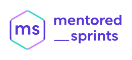

 

 

 <h2>Digital assets</h2>

 

This repository contains the Mentored Sprints digital assets. The contents of this repository are licensed under the OSI license [CC-BY 4.0](https://creativecommons.org/licenses/by/4.0/).

The Mentored Sprints brand guidelines can be found at [https://mentored-sprints.dev/brand](https://mentored-sprints.dev/brand). Make sure to read this carefully before making any derivative work or reusing content for your sprints.

:warning: Please note that the organisation logo was made for the mentored sprints by Ashley McNamara and features the Azure advocate Bit. Its use is reserved for the advocacy team at MSFT and the Mentored Sprints team.

## Mentored Sprints Official Colour Palette

### Main Colours

| NAME            | COLOUR HEX CODE                                                      |
| ---------------- | -------------------------------------------------------------------- |
| Blue Purple |  `#5936d9` |
| Lavender Rose  |  `#f2a2e5` |

### Secondary Colours

| NAME            | COLOUR HEX CODE                                                      |
| ---------------- | -------------------------------------------------------------------- |
| Blue Gem    |  `#3632a6` |
| Medium Turquoise  |  `#36d9c8` |
| Heliotrope |  `#d089ff` |
| Mauve  |  `#d1bafb` |
| Pink Lace  |  `#f6dfff` |

## Contents

- **[logos](./logos)**: main logos for the mentored sprints. Each variant can be found in both, svg and png format.
- **[old_assets](./old_assets)**: our old branding logos and marks
